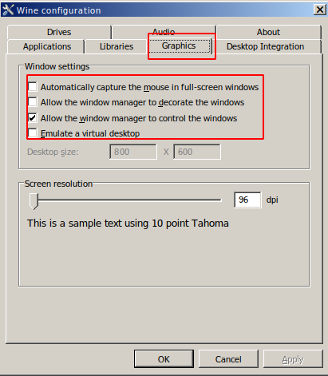
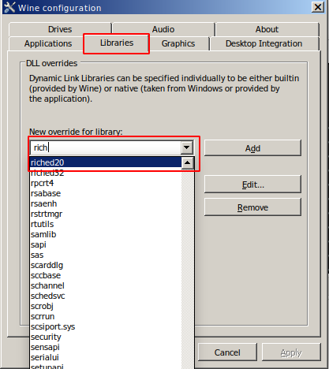
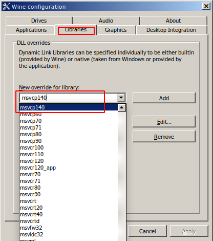

Ubuntu 安装企业微信
==================

企业微信没有网页版，也不支持 Linux(Ubuntu) 系统，下面是用 [wine](https://www.winehq.org/)
在 Ubuntu 系统上安装 Windows 版企业微信的过程。

安装步骤
--------

#### 安装最新稳定版 wine

```bash
$ sudo dpkg --add-architecture i386
$ wget -nc https://dl.winehq.org/wine-builds/winehq.key -O - | sudo apt-key add
$ sudo apt-add-repository "deb https://dl.winehq.org/wine-builds/ubuntu/ $(lsb_release -sc) main"
$ sudo apt update
$ sudo apt install winehq-stable
```

#### 安装 winetricks

```bash
$ wget  https://raw.githubusercontent.com/Winetricks/winetricks/master/src/winetricks -O /usr/local/bin/winetrick
$ chmod +x /usr/local/bin/winetricks
```

#### 安装动态链接库

```bash
$ winetricks directx9 vcrun2013 riched20
```

#### 配置 wine

```bash
$ winecfg
```

按提示安装缺失的程序，如果没有提示要安装直接进入配置过程

界面配置:



添加两个必要的库如果不存在:




#### 下载企业版微信

```bash
$ wget https://dldir1.qq.com/foxmail/work_weixin/WXWork_2.7.8.1239.exe
```

#### 安装解压工具

```bash
$ sudo apt install p7zip-rar
```

#### 解压企业微信

```bash
$ 7z x WXWork_2.7.8.1239.exe  -o$HOME/.wine/drive_c/Program\ Files/Tencent/WXWork
```

#### 添加 Desktop 文件

拷贝[logo](images/WXWork.png):

```bash
$ mkdir -p $HOME/.local/share/icons
$ cp images/WXWork.png $HOME/.local/share/icons/WXWork.png
```

新建文件 *wxwork.desktop*，写入如下内容:

```desktop
[Desktop Entry]
Type=Application
Exec=wine '~/.wine/drive_c/Program Files/Tencent/WXWork/WXWork.exe'
Icon=WXWork
Ternimal=false
Name=企业微信
```

拷贝 desktop 文件:

```bash
$ mkdir -p $HOME/.local/share/applications
$ cp wxwork.desktop $HOME/.local/share/applications
```

拷贝字体文件:

```bash
$ cp fonts/msyh.ttc $HOME/.wine/drive_c/windows/Fonts
```

进入 Applications 界面，点击企业微信图标。Enjoy!
